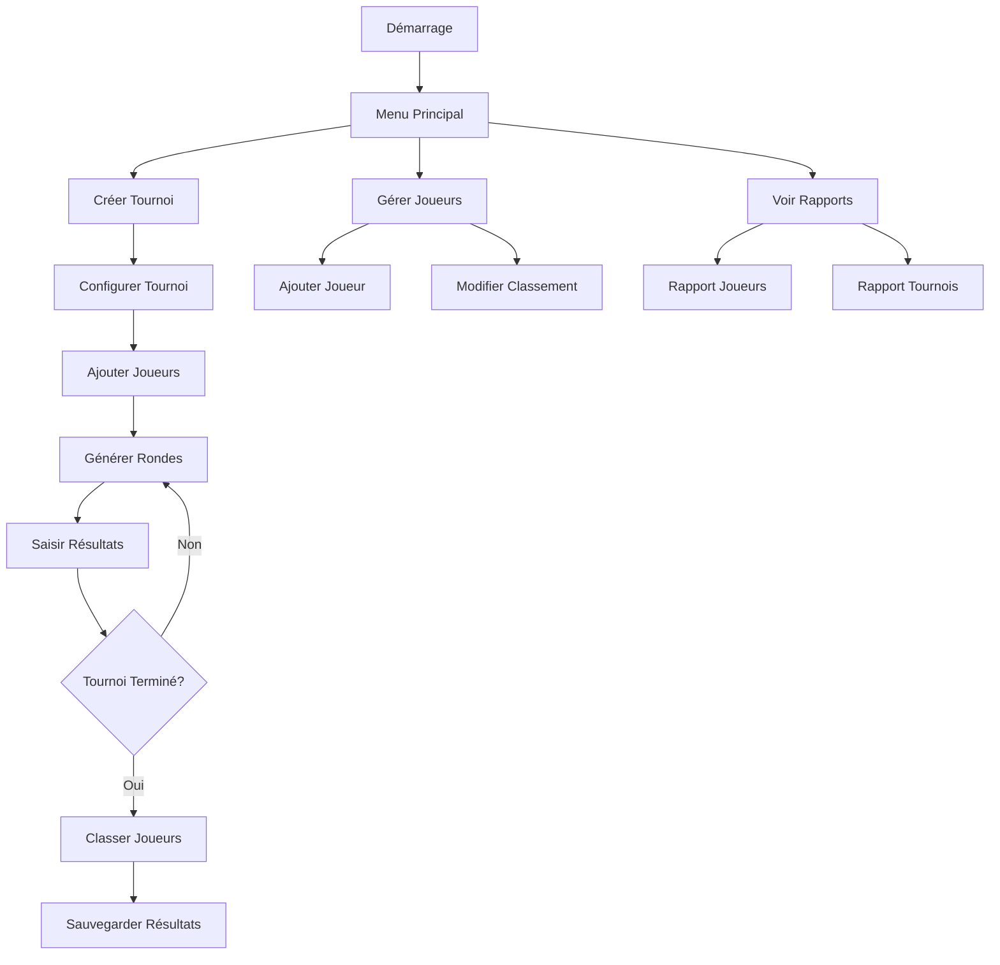

# Maxi Chess

Application web de gestion de tournois d'échecs

## Fonctionnement du projet

L'application permet de :
- Créer et gérer des tournois d'échecs
- Enregistrer des joueurs
- Générer des paires de joueurs selon le système suisse
- Enregistrer les résultats des matchs
- Mettre à jour le classement des joueurs
- Générer des rapports sur les tournois et les joueurs

### Structure du projet

```
projet4/
├── controllers/     # Logique métier
├── models/         # Modèles de données
├── views/          # Interface utilisateur
├── data/          # Stockage des données
└── utils/         # Utilitaires
```

## Méthode de déploiement

### Prérequis
- Python 3.8 ou supérieur
- pip (gestionnaire de paquets Python)

### Installation

1. Cloner le dépôt :
```bash
git clone [URL_DU_REPO]
cd projet4
```

2. Créer un environnement virtuel :
```bash
python -m venv env
source env/bin/activate  # Sur Unix/macOS
# ou
.\env\Scripts\activate  # Sur Windows
```

3. Installer les dépendances :
```bash
pip install -r requirements.txt
```

4. Lancer l'application :
```bash
python main.py
```

L'application sera accessible à l'adresse : `http://localhost:5000`

## Diagramme de flux



## Utilisation

1. **Gestion des joueurs**
   - Ajout de nouveaux joueurs
   - Modification des informations
   - Mise à jour des classements

2. **Création d'un tournoi**
   - Définition des paramètres
   - Sélection des joueurs
   - Configuration des rondes

3. **Déroulement du tournoi**
   - Génération automatique des paires
   - Saisie des résultats
   - Mise à jour des scores

4. **Rapports**
   - Liste des joueurs par classement
   - Historique des tournois
   - Statistiques des joueurs